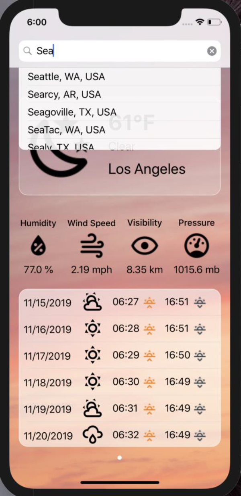

# iosWeatherApp

## Introduction
This is an iOS Mobile application<sup>1</sup> for weather search. This application allows users to 
search for weather details using the dark sky APIs and add locations in favorite list, 
and post on Twitter. The backend service is using node.js script

## Function and Display
### Launch and Initial Page
The launch screen and the main scene of this app are shown as follow. The initial view always displays the weather details of the current location automatically.
<p align="center">
  
  &nbsp &nbsp &nbsp &nbsp &nbsp &nbsp
  
</p>

The initial view of the App consists of three subviews:
1. The first sub view consists of weather Icon, temperature, weather summary and the City Name. The entire view is **clickable**. On clicking anywhere on the sub view, user will be navigated to the details page (which will be shown later).
<p align="center">
  
</p>

2. The second sub view consists of 4 fixed weather properties as shown bellow.
<p align="center">
  
</p>

3. The third sub view is a **scrollable** *UITableView*, with each cell displaying the data for next 7 days. THe data consists of the date, weather summary icon, sunrise time, sunrise icon, sunset time and sunset icon. The time is according to PST time zone.
<p align="center">
  
</p>

In the initial page, the interface consists a **Search Bar**, which is a *UISearchBar* component allowing the user to enter the city name. While typing in the search bar, the results will be provided using the autocomplete API. Here to show the autocomplete result, I used a *UITabView* component which is hidden/shown according to the response of the auto complete API.
<p align="center">
  
</p>

### Search Result Page
When the user taps any of the city from the autocomplete result list, the App will display a big spinner as following before it's ready to show the search results page. Then after it gets data from the backend, it will hide the spinner and display the result page with exactly the same layout as the initial page. 
<p align="center">
  
  &nbsp &nbsp &nbsp &nbsp &nbsp &nbsp
  
</p>

### Share to Twitter
On the search result page, there is a Twitter icon, which is a share button. Once the buttom is tapped, a web page will be opened (in Safari) to allow the user to share the weather information on Twitter, as shown bellow. 
<p align="center">
  
</p>

### Favorite List
Also, on the search result page, there is a + button which is a Favorite button. Tapping the button will add the corresponding Weather city into the Favorite List. A message will be displayed at the bottom of the App and the Favorite button will change into 'x' button, as shown bellow. Tapping that button again will remove that city from the Favorite List, and a similar message will also be displayed to indicate that the city has been removed from Favorite List and the button is changed back to '+' button.
<p align="center">
  
</p>
Besides, the state of the Favorite buttom is consistent. If the user searched for a city that is already in the Favorite List, then on search results page, the state of the Favorite button will be 'x', not '+', and the Favorite List should persist even after closing the app. The items will be removed from the Favorite List only if the user removes them.
I used *UIPageControl* and *UIScrollView* to display the weather detail of the cities adding the Favorite List. To store Favorite List data, I used *User Default*.


### Weather Detail Page
Tapping on the first sub view will show the Weather Detail Page, with three tabs named as: Today, Weekly and Photos (of the city) from google. A spinner will be shown before the App is ready to display information in Today tab and Photos tab. 
All the three tabs share the same *Navigation Bar* on the top. The navigation bar includes the following elements:
1. Back button: navigates back to the search results page
2. Twitter button
3. City Name: as Title of the header

### Today Tab
The today tab contains a collection view having 9 items as shown. Each Item has corresponding icon, property name and its value with units.
<p align="center">
  
</p>

### Weekly Tab
Weekly Tab consists of the following:
1. Weekly Weather Summary View: the weather summary of the entire week and the corresponding icon. 
2. A Line chart showing minimum and maximum temperature trend during the week by using *charts pod*.
<p align="center">
  
</p>

### Google Photos Tab
The Google Images are fetched using the name of the city and shown as *UIScrollView* with vertical scroll. I used **google custom search API** for image search.
<p align="center">
  
</p>

## Resorces and APIs
### CocoaPods
CocoaPods is a dependency manager for Swift and Objective-C Cocoa projects. It has over ten thousand libraries and can help you scale your projects elegantly. You can install dependencies using it, we will need to install many third-party modules and frameworks using it.

CocoaPods is built with Ruby and is installable with the default Ruby available on macOS. We recommend you use the default Ruby. Using the default Ruby install can require you to use ‘sudo’ when installing gems.

Run the command below in your Mac terminal:
```$ sudo gem install cocoapods```

Once you have created your Xcode project, you can start to integrate CocoaPods into your project.

The following pods will be needed:
1. [SwiftyJSON](https://github.com/SwiftyJSON/SwiftyJSON): To handle JSON data.
2. [Alamofire](https://github.com/Alamofire/Alamofire): To make HTTP requests.
3. [Toast-Swift](https://github.com/scalessec/Toast-Swift) ~> 4.0.0* : To display toast messages in your app
4. [SwiftSpinner](https://github.com/icanzilb/SwiftSpinner) : For the big loading spinner.
5. [Charts](https://github.com/danielgindi/Charts): For implementing charts on weekly Tab.

<sup>1</sup>This README file is refferd from the description of CSCI571 hw9 of University of California by Professor Papa.
